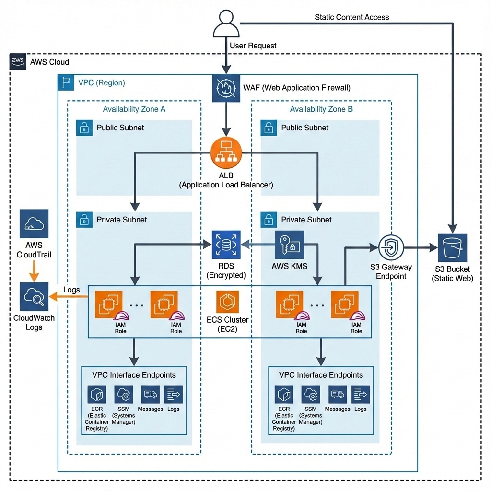

# AWS Well-Architected Infrastructure Deployment Guide

## Prerequisites

### Install Terraform
```bash
# Linux/macOS
wget https://releases.hashicorp.com/terraform/1.10.1/terraform_1.10.1_linux_amd64.zip
unzip terraform_1.10.1_linux_amd64.zip
sudo mv terraform /usr/local/bin/
terraform --version
```

### Install AWS CLI
```bash
# Linux/macOS
curl "https://awscli.amazonaws.com/awscli-exe-linux-x86_64.zip" -o "awscliv2.zip"
unzip awscliv2.zip
sudo ./aws/install
aws --version
```

### Configure AWS Credentials
```bash
aws configure
# Enter: Access Key ID, Secret Access Key, Region (us-east-1), Output (json)
aws sts get-caller-identity
```

### Clone Repository
```bash
git clone https://github.com/your-username/aws-wellarchitected-framework.git
cd aws-wellarchitected-framework
```

---

## Project Directory Structure

```
aws-wellarchitected-framework/
├── .github/
│   └── workflows/
│       ├── deploy-backend.yml
│       ├── deploy-website.yml
│       └── cleanup-s3-objects.yml
├── backend/
│   ├── app.py
│   ├── Dockerfile
│   ├── requirements.txt
│   └── init_db.sql
├── modules/
│   ├── alb/
│   │   ├── main.tf
│   │   ├── outputs.tf
│   │   └── variables.tf
│   ├── compute/
│   │   ├── main.tf
│   │   ├── outputs.tf
│   │   └── variables.tf
│   ├── database/
│   │   ├── main.tf
│   │   ├── outputs.tf
│   │   └── variables.tf
│   ├── ecr/
│   │   ├── main.tf
│   │   ├── outputs.tf
│   │   └── variables.tf
│   ├── ecs/
│   │   ├── main.tf
│   │   ├── outputs.tf
│   │   └── variables.tf
│   ├── security/
│   │   ├── main.tf
│   │   ├── outputs.tf
│   │   └── variables.tf
│   ├── storage/
│   │   ├── main.tf
│   │   ├── outputs.tf
│   │   └── variables.tf
│   ├── vpc/
│   │   ├── main.tf
│   │   ├── outputs.tf
│   │   └── variables.tf
│   └── waf/
│       ├── main.tf
│       ├── outputs.tf
│       └── variables.tf
├── website/
│   ├── admin/
│   │   ├── dashboard.html
│   │   └── login.html
│   ├── css/
│   │   └── style.css
│   ├── js/
│   │   ├── admin.js
│   │   ├── app.js
│   │   ├── config.js
│   │   ├── dashboard.js
│   │   └── status.js
│   ├── index.html
│   └── status.html
├── main.tf
├── variables.tf
├── outputs.tf
├── terraform.tfvars
├── .gitignore
└── README.md
```

### Key Components:
- **`.github/workflows/`** - CI/CD pipelines for automated deployment
- **`backend/`** - Python Flask application with Docker configuration
- **`modules/`** - Terraform modules for infrastructure components
- **`website/`** - Static frontend files for S3 hosting
- **Root files** - Main Terraform configuration and variables

---

## Project Architecture



### Architecture Highlights:
- **Zero Internet Egress**: Private instances use VPC endpoints instead of NAT Gateway
- **Multi-AZ Deployment**: Resources distributed across 2 availability zones
- **Layered Security**: WAF → ALB → Private subnets → Security groups
- **Container Orchestration**: ECS manages Docker containers on EC2 instances
- **Sticky Sessions**: ALB maintains user sessions for stateful applications
- **Encrypted Storage**: RDS and S3 use encryption at rest
- **Session Manager**: Secure access to private resources without Bastion

---

## Infrastructure Deployment

### Step 1: Configure Variables
```bash
# Create terraform.tfvars
cat > terraform.tfvars << EOF
project_name = "aws-sec-pillar"
environment = "prod"
aws_region = "us-east-1"
vpc_cidr = "10.0.0.0/16"
availability_zones = ["us-east-1a", "us-east-1b"]
public_subnet_cidrs = ["10.0.1.0/24", "10.0.2.0/24"]
private_subnet_cidrs = ["10.0.10.0/24", "10.0.20.0/24"]
EOF
```

### Step 2: Initialize Terraform
```bash
terraform init
```

### Step 3: Plan Infrastructure
```bash
terraform plan
```
Expected: ~60+ resources including VPC, subnets, security groups, ALB, ECS, ECR, RDS, S3, WAF, VPC endpoints

### Step 4: Deploy Infrastructure
```bash
terraform apply --auto-approve
```
Deployment time: 15-20 minutes

### Step 5: Get Outputs
```bash
terraform output
```
Key outputs:
- `alb_dns_name` - Load balancer DNS for backend API
- `website_url` - S3 static website URL
- `ecr_repository_url` - Container registry URL
- `ecs_cluster_name` - ECS cluster name

---

## GitHub Actions CI/CD Deployment

### Setup Repository Secrets
Navigate to GitHub repository → Settings → Secrets and variables → Actions:
```
AWS_ACCESS_KEY_ID = your-access-key-id
AWS_SECRET_ACCESS_KEY = your-secret-access-key
```

### Automated Workflows

**Backend Deployment** (`.github/workflows/deploy-backend.yml`):
- Triggers on changes to `backend/` directory
- Builds Docker image and pushes to ECR
- Forces ECS service deployment with new image
- Uses commit SHA as image tag

**Website Deployment** (`.github/workflows/deploy-website.yml`):
- Triggers on changes to `website/` directory
- Discovers S3 bucket and ALB DNS automatically
- Manually updates frontend **config.js file** with ALB endpoint (**BASE-URL = alb-dns-name**)
- Syncs files to S3 with correct content types

**S3 Cleanup** (`.github/workflows/cleanup-s3-objects.yml`):
- Manual trigger workflow
- Empties S3 bucket before Terraform destroy
- Handles versioned objects and delete markers

### Deploy via GitHub Actions
```bash
# Trigger backend deployment
git add backend/
git commit -m "Deploy backend application"
git push origin main

# Trigger website deployment
git add website/
git commit -m "Deploy frontend"
git push origin main
```

---

## Access Applications

### Public Website
```bash
http://website_url
```
Features:
- Company registration form with business details
- Status checking by reference ID or registration number
- Certificate download for approved registrations
- Responsive design for all devices

### Admin Dashboard
```bash
http://alb_dns_name/health
http://alb_dns_name/admin/login
```
Credentials: admin / admin123

Features:
- View pending company registrations
- Approve or reject registrations with one click
- View approved registrations with approval dates
- Secure session management with sticky sessions

### If the backend is not responding, troubleshoot as follows:

#### Session Manager Access
```bash
# List available ECS instances
aws ssm describe-instance-information --query "InstanceInformationList[?PingStatus=='Online'].[InstanceId,Name,PlatformName]"

# Connect to ECS instance directly
aws ssm start-session --target <instance-id>

# Alternative: Get instance ID from EC2
aws ec2 describe-instances --filters "Name=tag:Name,Values=aws-sec-pillar-prod-instance" "Name=instance-state-name,Values=running" --query "Reservations[*].Instances[*].InstanceId" --output text
```

---

## Troubleshooting Commands

### ECS Service Debugging
```bash
# Check service status
aws ecs describe-services --cluster $(terraform output -raw ecs_cluster_name) --services aws-sec-pillar-prod-service

# Check task definition
aws ecs describe-task-definition --task-definition aws-sec-pillar-prod-task

# List running tasks
aws ecs list-tasks --cluster $(terraform output -raw ecs_cluster_name) --service-name aws-sec-pillar-prod-service

# Check task logs
aws logs describe-log-groups --log-group-name-prefix "/ecs/aws-sec-pillar-prod"
aws logs get-log-events --log-group-name "/ecs/aws-sec-pillar-prod" --log-stream-name "ecs/backend/<task-id>"
```

### On ECS Container Instances
```bash
# Check ECS agent status
sudo systemctl status ecs

# Check ECS agent logs
sudo journalctl -u ecs -n 50

# Check running containers
docker ps

# Check container logs
docker logs <container_id>

# Check system resources
free -h
df -h
top -n 1

# Check cloud-init logs
sudo cat /var/log/cloud-init-output.log | tail -100

# Restart ECS agent if needed
sudo systemctl restart ecs
```

### ALB and Target Group Health
```bash
# Check ALB status
aws elbv2 describe-load-balancers --names aws-sec-pillar-prod-alb

# Check target group health
aws elbv2 describe-target-health --target-group-arn $(terraform output -raw target_group_arn)

# Test ALB health endpoint
curl http://$(terraform output -raw alb_dns_name)/health
```

---

## Architecture Components

### Network Infrastructure
- **VPC**: 10.0.0.0/16 across 2 availability zones
- **Public Subnets**: 10.0.1.0/24, 10.0.2.0/24 (ALB only)
- **Private Subnets**: 10.0.10.0/24, 10.0.20.0/24 (ECS instances, RDS)
- **VPC Endpoints**: S3 (Gateway), ECR API/DKR, ECS, CloudWatch Logs, SSM (Interface)
- **No NAT Gateway**: Cost optimization using VPC endpoints

### Compute Infrastructure
- **ECS Cluster**: EC2 launch type with Amazon Linux 2023 ECS-optimized AMI
- **Auto Scaling Group**: 1-3 t3.micro instances across AZs
- **ECS Service**: 2 tasks with dynamic port mapping (bridge network mode)
- **Load Balancer**: Application Load Balancer with health checks on `/health`


### Container Infrastructure
- **ECR Repository**: Private container registry with image scanning
- **Lifecycle Policy**: Keeps last 5 images, auto-cleanup on destroy
- **Task Definition**: 256 CPU/256 MB memory, port 5000
- **Service Discovery**: Dynamic port mapping with ALB target group

### Data Infrastructure
- **RDS MySQL 8.0**: t3.micro, 20GB encrypted storage in private subnets
- **S3 Bucket**: Static website hosting with encryption and versioning
- **Database**: Shared across ECS tasks via environment variables

### Security Infrastructure
- **Security Groups**: Least privilege (ALB→ECS:5000, ECS→RDS:3306)
- **WAF v2**: AWS managed rules (Common, Known Bad Inputs) + rate limiting (2000/IP)
- **IAM Roles**: ECS task execution, EC2 container service, SSM access
- **Session Manager**: Secure shell access via AWS APIs (no SSH keys required)
- **VPC Endpoints**: SSM, SSM Messages, EC2 Messages for private connectivity
- **Encryption**: RDS and S3 at rest, HTTPS in transit

### Monitoring and Logging
- **CloudWatch Logs**: ECS task logs with 7-day retention
- **WAF Metrics**: CloudWatch metrics for blocked requests
- **Health Checks**: ALB health checks every 30s on `/health`

---

## Cost Optimization

- **ECS on EC2**: Shared compute resources, more cost-effective than Fargate for persistent workloads
- **t3.micro instances**: Free tier eligible, burstable performance
- **VPC Endpoints**: Eliminates NAT Gateway (~$45/month savings)
- **Auto Scaling**: Scales down during low usage (min 1, max 3)
- **ECR Lifecycle**: Automatic image cleanup prevents storage costs
- **S3 Intelligent Tiering**: Automatic cost optimization for website assets

**Estimated Monthly Cost**: $65-95 depending on usage

### Compliance Features
- All data encrypted at rest (RDS AES-256, S3 AES-256)
- Network segmentation with private subnets
- Least privilege IAM policies
- WAF protection against OWASP Top 10
- VPC Flow Logs for network monitoring
- Regular security updates via container rebuilds

---

## Cleanup

### Method 1: Automated (Recommended)
```bash
# Empty S3 bucket first (prevents Terraform destroy errors)
# Go to GitHub Actions → Empty S3 Bucket → Run workflow

# Then destroy infrastructure
terraform destroy --auto-approve
```

## Advanced Operations

### Scaling ECS Service
```bash
# Scale up to 4 tasks
aws ecs update-service --cluster $(terraform output -raw ecs_cluster_name) --service aws-sec-pillar-prod-service --desired-count 4

# Scale down to 1 task
aws ecs update-service --cluster $(terraform output -raw ecs_cluster_name) --service aws-sec-pillar-prod-service --desired-count 1
```

### Database Operations
```bash
# On Your Local Machine: Get the RDS endpoint address:
terraform output -raw rds_endpoint

# Copy the value (e.g., aws-sec-pillar-prod-db.xyzw.us-east-1.rds.amazonaws.com:3306).

# Connect to RDS from ECS instance. On The Private EC2 Instance
# 1. Install MySQL client (Amazon Linux 2023)
sudo dnf install mariadb105 -y

# 3. Connect (Run this ON THE PRIVATE INSTANCE)
# Replace <rds-endpoint> with the value you copied (remove :3306 if present, or keep it)
mysql -h <rds-endpoint-without-port> -u admin -p appdb

# Enter password: **changeme123!**

# Run SQL queries to verify data in RDS.
# Select the database:
show databases;
USE appdb;

**(It should say "Database changed")**
# See all tables (to confirm companies exists):
SHOW TABLES;

# View all registered companies:
SELECT * FROM companies;

** (This will list every registration. If it is empty, try registering a new company on the website and running this command again.)**

# Count records:
SELECT COUNT(*) FROM companies;
```

This comprehensive guide covers the complete architecture as implemented, including all modules, workflows, and operational procedures.